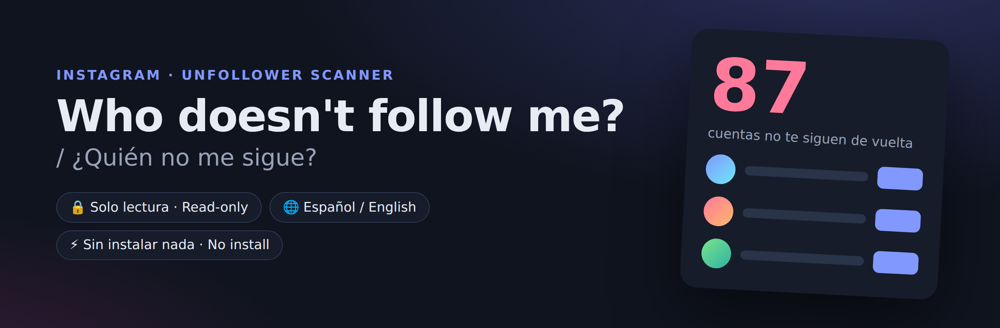
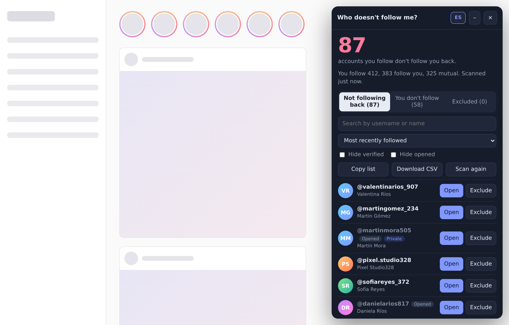
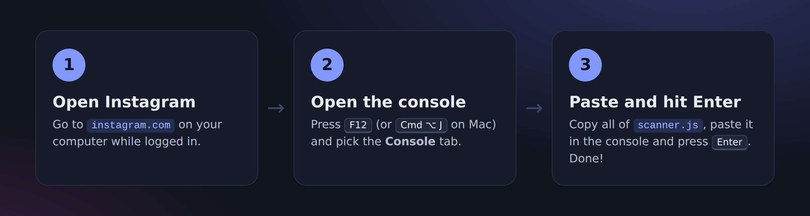
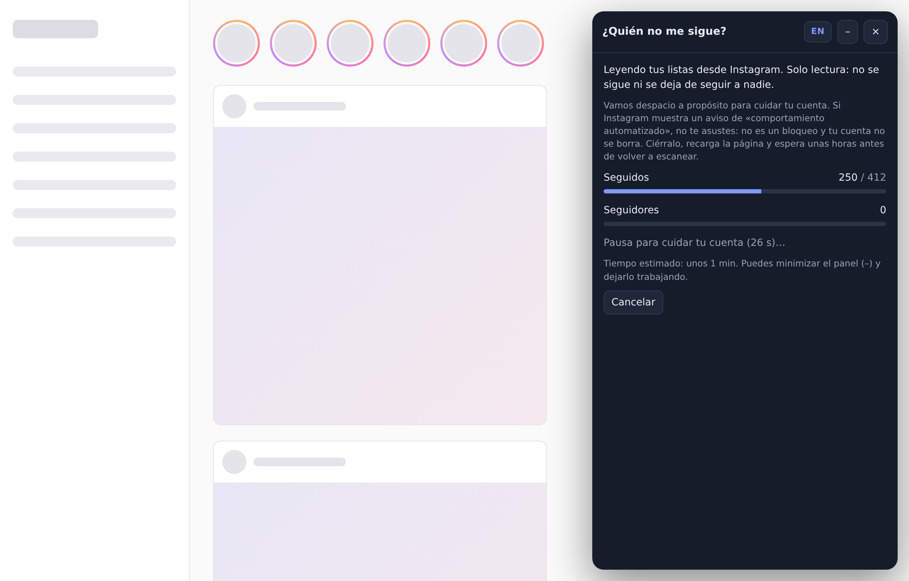
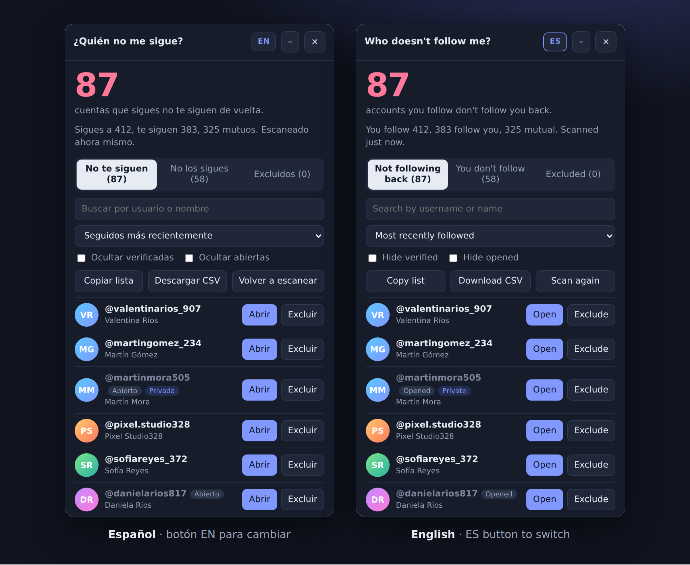
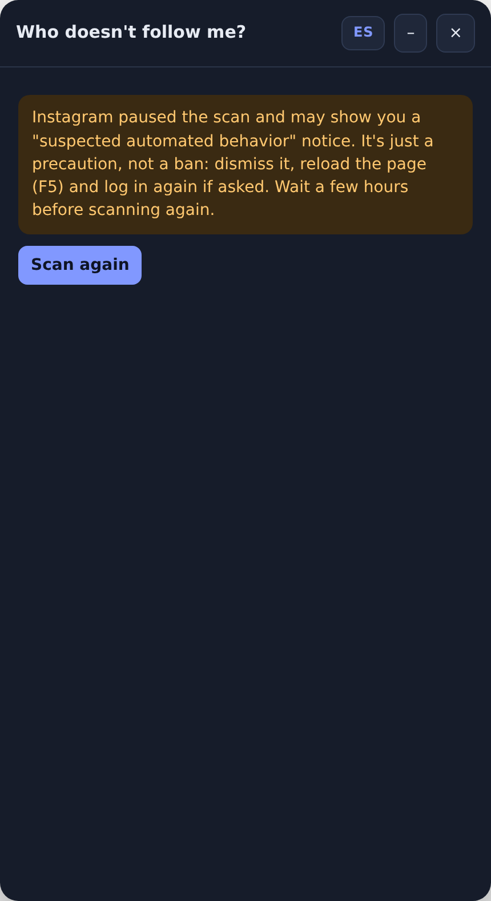

<div align="center">



[Español](README.md) · **English**

A scanner that shows you **who doesn't follow you back on Instagram**.<br>
You paste it into your browser. Nothing to install, no passwords, and it's **read-only**.

</div>

---

## ✨ What does it do?

It compares the accounts you **follow** with the accounts that **follow you** and shows you the difference in a tidy panel:



| | |
|---|---|
| 🔴 **Not following back** | Accounts you follow that don't follow you back. |
| 🔵 **You don't follow** | Accounts that follow you but you don't follow. |
| ⚪ **Excluded** | Accounts you chose to ignore (your best friend, your favorite artist…). |

You can also **search**, **sort**, **hide verified** accounts, mark the ones you've already **opened**, **copy the list** or **download it as CSV** (opens in Excel or Google Sheets).

## 🚀 How to use it (1 minute)



1. On your **computer**, open [instagram.com](https://www.instagram.com) and log in.
2. Open the browser console:
   - **Windows / Linux:** <kbd>F12</kbd> or <kbd>Ctrl</kbd> + <kbd>Shift</kbd> + <kbd>J</kbd>
   - **Mac:** <kbd>Cmd</kbd> + <kbd>Option</kbd> + <kbd>J</kbd>
   - Then click the **Console** tab.
3. Open [`scanner.js`](scanner.js), click GitHub's **Copy raw file** button (📋), paste it into the console and press <kbd>Enter</kbd>.

A panel appears on the right and starts reading your lists:



> [!TIP]
> **Browser won't let you paste?** Chrome and Edge block it the first time as a safety measure. Type `allow pasting`, press <kbd>Enter</kbd> and paste again.

## 🌐 English / Español

A button in the panel's corner switches the language instantly, no re-scan needed. The first time it follows your browser's language; after that it remembers your choice.



## 🔒 Is it safe?

- **Read-only.** The code never follows or unfollows anyone. You decide what to do via the **Open** button, which takes you to the profile.
- **Nothing leaves your browser.** No servers, no accounts, no tracking. It only talks to Instagram, just like the app does.
- **No password needed.** It uses the session you already have open.
- **Open source.** One commented file you can read before running it.

> [!WARNING]
> As a general rule, **never paste code into the console that you don't understand or that comes from someone you don't trust**. You can (and should) read all of [`scanner.js`](scanner.js) before using it.

## 😱 Got "We suspect automated behavior on your account"?

**Relax: it's not a ban, your account won't be deleted and nobody hacked you.** It's a preventive notice Instagram shows when it sees lots of requests in a row from your account, like the ones this scanner makes while reading your lists.

**What to do:**

1. Click the button on the notice to dismiss it.
2. Reload the page (<kbd>F5</kbd>) and log in again if asked.
3. Wait a few hours before scanning again.

The notice always suggests changing your password, but that's a generic message. This script never sends your password or data anywhere, so the scanner isn't a reason to change it (though a strong password never hurts).

**What the scanner does to avoid it:**

- It goes **slowly on purpose**: 1.8–3 seconds between each batch of 50 accounts, a 20–30 second break every 10 batches, and another pause between the following and followers lists.
- At Instagram's first sign that you're going too fast, it **stops** instead of retrying.
- It **stops on its own** if Instagram shows the notice, instead of pushing on, and tells you what to do:



- If you scan again within 1 hour, it warns you and offers your saved results instead.

> [!NOTE]
> Instagram doesn't officially allow automated tools, so the risk is never zero. Take it easy: **once a day at most** is plenty.

## 🙋 FAQ

<details>
<summary><b>Does it work on my phone?</b></summary>

No. It needs a desktop browser console (Chrome, Edge, Firefox, Brave, Safari…).
</details>

<details>
<summary><b>I have lots of followers — how long does it take?</b></summary>

Since it goes slowly to keep your account safe, around 1,000 followers and 1,000 following takes about **3–4 minutes** (2,000 and 2,000, about 7). The panel shows an estimated time when it starts. You can minimize it with the **–** button and let it work.
</details>

<details>
<summary><b>I got an "incomplete data" warning.</b></summary>

Sometimes Instagram returns fewer accounts than your profile shows. When that happens, some people could appear by mistake under *Not following back*. Wait a while and click **Scan again**.
</details>

<details>
<summary><b>Why does it show results without scanning?</b></summary>

It keeps the last scan in your browser for 6 hours so it doesn't query Instagram again for no reason. Click **Scan again** to refresh.
</details>

<details>
<summary><b>Where are my "Excluded" accounts stored?</b></summary>

In your browser's local storage (`localStorage`), on your computer. Nobody else sees them.
</details>

## 🛠️ For developers

```
scanner.js            ← the whole script (the only thing you need)
docs/                 ← README images
tools/screenshots.py  ← builds screenshots with FAKE data on a simulated Instagram
tools/graphics.py     ← builds the banner and illustrations
```

Every screenshot uses made-up accounts. To regenerate them:

```bash
pip install playwright && playwright install chromium
python tools/screenshots.py && python tools/graphics.py
```

## ⚖️ Disclaimer

Personal project, not affiliated with Instagram or Meta. It uses internal endpoints of Instagram's website, which can change without notice and break the script. Use it in moderation and at your own risk.

[MIT](LICENSE) license.
