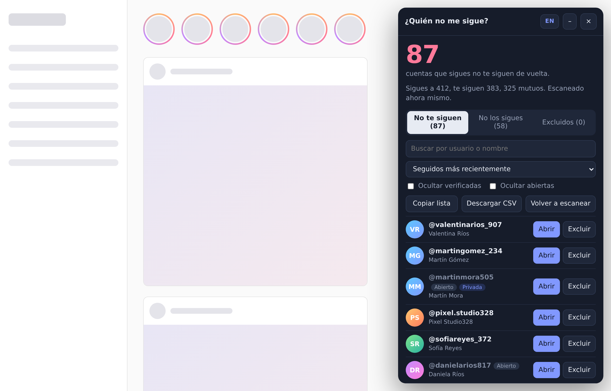
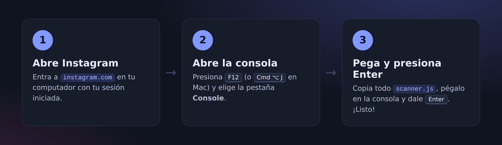
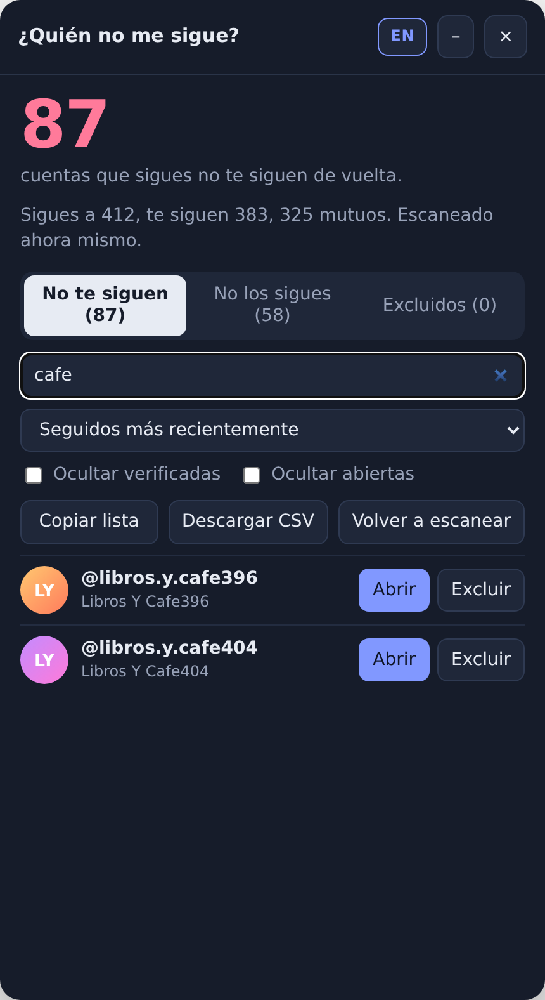
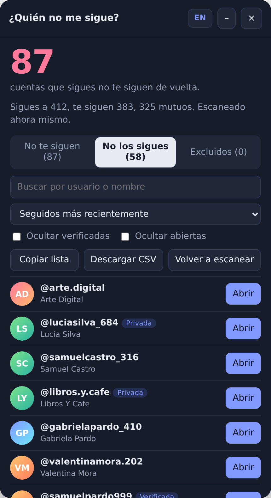
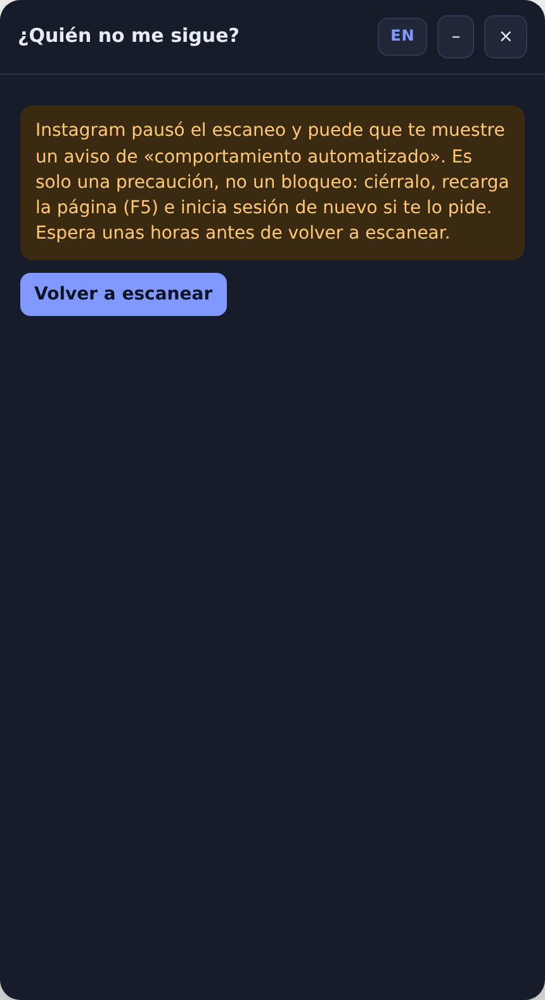

<div align="center">


**Español** · [English](README.en.md)

Un escáner que te muestra **quién no te sigue de vuelta en Instagram**.<br>
Se pega en el navegador. No hay nada que instalar, no pide contraseñas y es **solo lectura**.

</div>

---

## ✨ ¿Qué hace?

Compara las cuentas que **sigues** con las cuentas que **te siguen** y te muestra la diferencia en un panel ordenado:



| | |
|---|---|
| 🔴 **No te siguen** | Cuentas que tú sigues pero no te siguen de vuelta. |
| 🔵 **No los sigues** | Cuentas que te siguen pero tú no sigues. |
| ⚪ **Excluidos** | Cuentas que marcaste para ignorar (tu mejor amigo, tu artista favorito…). |

Además puedes **buscar**, **ordenar**, **ocultar verificadas**, marcar las que ya **abriste**, **copiar la lista** o **descargarla en CSV** (para abrir en Excel o Google Sheets).

## 🚀 Cómo usarlo (1 minuto)



1. En tu **computador**, abre [instagram.com](https://www.instagram.com) con tu sesión iniciada.
2. Abre la consola del navegador:
   - **Windows / Linux:** <kbd>F12</kbd> o <kbd>Ctrl</kbd> + <kbd>Shift</kbd> + <kbd>J</kbd>
   - **Mac:** <kbd>Cmd</kbd> + <kbd>Option</kbd> + <kbd>J</kbd>
   - Luego haz clic en la pestaña **Console / Consola**.
3. Abre [`scanner.js`](scanner.js), pulsa el botón **Copy raw file** (📋) de GitHub, pégalo en la consola y presiona <kbd>Enter</kbd>.

Aparece un panel a la derecha que va leyendo tus listas:


> [!TIP]
> **¿El navegador no te deja pegar?** Chrome y Edge lo bloquean la primera vez como protección. Escribe `allow pasting` (o `permitir pegar`), presiona <kbd>Enter</kbd> y vuelve a pegar.

## 🌐 Español / English

Un botón en la esquina del panel cambia el idioma al instante, sin volver a escanear. La primera vez usa el idioma de tu navegador y después recuerda el que elegiste.


## 🔍 Buscar y filtrar

<table>
<tr>
<td width="50%"></td>
<td width="50%"></td>
</tr>
<tr>
<td align="center">Busca por usuario o por nombre</td>
<td align="center">Mira quién te sigue y tú no</td>
</tr>
</table>

## 🔒 ¿Es seguro?

- **Solo lectura.** El código nunca sigue ni deja de seguir a nadie. Tú decides qué hacer con el botón **Abrir**, que lleva al perfil.
- **Nada sale de tu navegador.** No hay servidores, ni cuentas, ni rastreo. Solo habla con Instagram, igual que la app.
- **No pide tu contraseña.** Usa la sesión que ya tienes abierta.
- **Código abierto.** Es un solo archivo, comentado, que puedes leer antes de usarlo.

> [!WARNING]
> Como regla general, **nunca pegues en la consola código que no entiendas o que venga de alguien en quien no confías**. Aquí puedes (y deberías) leer [`scanner.js`](scanner.js) completo antes de usarlo.

## 😱 ¿Te salió «We suspect automated behavior on your account»?

**Tranquilo: no es un baneo, no te van a borrar la cuenta y nadie te hackeó.** Es un aviso preventivo que Instagram muestra cuando ve muchas consultas seguidas desde tu cuenta, como las que hace este escáner al leer tus listas.

**Qué hacer:**

1. Pulsa el botón del aviso para cerrarlo.
2. Recarga la página (<kbd>F5</kbd>) e inicia sesión otra vez si te lo pide.
3. Espera unas horas antes de volver a escanear.

El aviso siempre sugiere cambiar la contraseña, pero es un mensaje genérico. Este script no envía tu contraseña ni tus datos a ningún lado, así que no es necesario por culpa del escáner (aunque nunca está de más usar una contraseña fuerte).

**Qué hace el escáner para evitarlo:**

- Va **despacio a propósito**: espera entre 1,8 y 3 segundos entre cada bloque de 50 cuentas, descansa entre 20 y 30 segundos cada 10 bloques y hace otra pausa entre la lista de seguidos y la de seguidores.
- Al primer aviso de Instagram de que vas muy rápido, **se detiene** en lugar de reintentar.
- **Se detiene solo** si Instagram muestra el aviso, en vez de seguir insistiendo, y te explica qué hacer:



- Si vuelves a escanear antes de 1 hora, te avisa y te ofrece ver los resultados guardados.

> [!NOTE]
> Instagram no permite oficialmente herramientas automatizadas, así que el riesgo nunca es cero. Úsalo con calma: **una vez al día como mucho** es más que suficiente.

## 🙋 Preguntas frecuentes

<details>
<summary><b>¿Funciona en el celular?</b></summary>

No. Necesita la consola de un navegador de computador (Chrome, Edge, Firefox, Brave, Safari…).
</details>

<details>
<summary><b>Tengo muchos seguidores, ¿cuánto se demora?</b></summary>

Como va despacio para cuidar tu cuenta, con unos 1.000 seguidores y 1.000 seguidos tarda alrededor de **3 a 4 minutos** (con 2.000 y 2.000, unos 7). El panel te muestra un tiempo estimado al empezar. Puedes minimizarlo con el botón **–** y dejarlo trabajando.
</details>

<details>
<summary><b>Me salió un aviso de "datos incompletos".</b></summary>

A veces Instagram entrega menos cuentas de las que muestra tu perfil. Si eso pasa, algunas personas podrían aparecer por error en *No te siguen*. Espera un rato y pulsa **Volver a escanear**.
</details>

<details>
<summary><b>¿Por qué me muestra resultados sin escanear?</b></summary>

Guarda el último escaneo durante 6 horas en tu navegador para no consultar a Instagram de nuevo sin necesidad. Pulsa **Volver a escanear** para actualizar.
</details>

<details>
<summary><b>¿Dónde se guardan mis "Excluidos"?</b></summary>

En el almacenamiento local de tu navegador (`localStorage`), en tu computador. Nadie más los ve.
</details>

<details>
<summary><b>Dice "Instagram no reconoce tu sesión".</b></summary>

Recarga la página, confirma que iniciaste sesión y vuelve a pegar el código.
</details>

## 🛠️ Para desarrolladores

```
scanner.js            ← el script completo (lo único que necesitas)
docs/                 ← imágenes del README
tools/screenshots.py  ← genera las capturas con datos FALSOS en un Instagram simulado
tools/graphics.py     ← genera el banner y las ilustraciones
```

Todas las capturas usan cuentas inventadas. Para regenerarlas:

```bash
pip install playwright && playwright install chromium
python tools/screenshots.py && python tools/graphics.py
```

## ⚖️ Aviso

Proyecto personal sin relación con Instagram ni con Meta. Usa endpoints internos de la web de Instagram, que pueden cambiar sin previo aviso y dejar el script sin funcionar. Úsalo con moderación y bajo tu propia responsabilidad.

Licencia [MIT](LICENSE).
